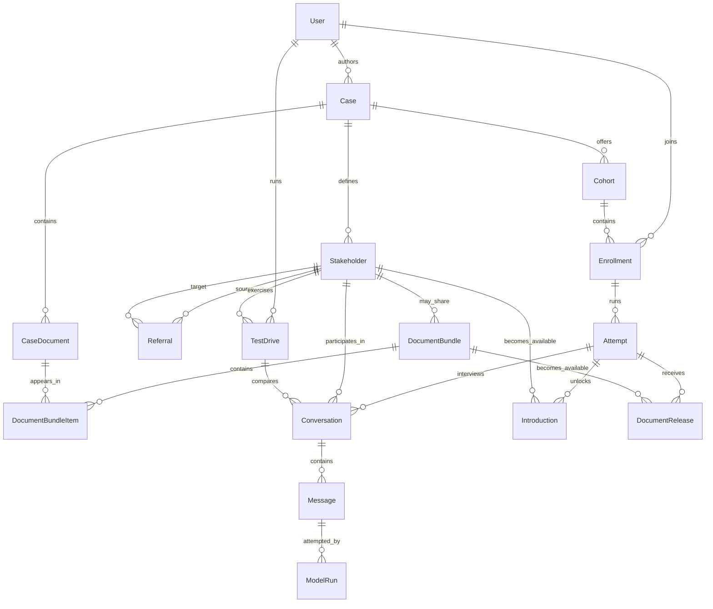

# Target domain model

**Status:** accepted for the prototype 
**Implementation:** verified for persistence and lifecycle semantics; concurrent authoring integration, auth, and product UI remain planned 
**Last verified:** 2026-08-13

This is the canonical model implemented by the current schema and lifecycle
services. The first-pass `CaseStudy`, `Contact`, top-level join code, and raw
CRUD surface have been removed rather than preserved for compatibility.

## Records and responsibilities

### User

Owns Rodauth account data plus `full_name`. A user can author and enroll without
a separate role record. The prototype has no administrator role or support UI.

### Case

Fields: `author_id`, `title`, `background`, `assignment`, `status`,
`published_configuration`, and `published_at`.

`status` is `draft`, `published`, or `archived`. The author edits normalized
records. Publishing validates the whole case and atomically replaces a JSON
configuration snapshot. New attempts copy that snapshot; new learner
conversations copy the relevant stakeholder configuration from their attempt.
We deliberately do not build a publication history or general revision system
for the prototype.

### Cohort and Enrollment

`Cohort` belongs to a case and owns `name`, a unique canonicalized `join_code`,
and optional `due_at`. `Enrollment` joins a user to a cohort. Its uniqueness is
`[user_id, cohort_id]`, which still permits the same user to join another cohort
of the same case.

### Attempt

Belongs to an enrollment and has `sequence`, `started_at`, `ended_at`, and a
`configuration_snapshot` copied from the case's current publication. There is
at most one open attempt per enrollment. Reset closes the open attempt and
creates the next sequence with the latest publication in one transaction.
Cohort summary metrics use the current attempt; authors can drill into all
attempts; learners see only their current one.

### Stakeholder and Referral

`Stakeholder` belongs to a case and has `name`, `role_title`, `description`,
free-form `instructions`, `knows_case_background` (default `true`),
`available_at_start`, `included_in_publication`, `provider`, `model_id`, and a
small provider-settings JSON object. `included_in_publication` is explicit
draft state, not soft deletion: an author can exclude a stakeholder from a
later publication and re-include it later. `publication_locked_at` records when
the stakeholder first enters a published snapshot; it can still be edited or
excluded from later publications, but cannot be hard-deleted after that point.
Deleting an unpublished stakeholder also deletes its disposable author test
drives; a published stakeholder and its runtime history remain protected.

`Referral` links a source stakeholder to a target stakeholder in the same case
and contains author guidance about when an introduction is natural. Row
existence means the path is enabled; there is no redundant `enabled` flag.

### CaseDocument, DocumentBundle, and DocumentBundleItem

`CaseDocument` belongs to a case and has a title, description, an optional
learner-visible text rendering, and one Active Storage attachment. A document
may be initially available. `attachment_locked_at` records when a publication
first references its attachment; from then on the file cannot be replaced,
purged, or hard-deleted. An author replaces it by creating a new document record
for a later publication, preserving the file seen by active conversations.

`DocumentBundle` belongs to a stakeholder and has a human-readable name,
sharing guidance, `included_in_publication`, and `publication_locked_at` with
the same exclusion and no-hard-delete semantics as a published stakeholder.
`DocumentBundleItem` orders case documents within a bundle. Bundles express one
domain action without duplicating files when several documents should arrive
together.

Only documents available at the start or present in an included configured
bundle enter a publication snapshot and become locked. This deliberately does
not compute referral-graph reachability. Unused draft documents remain
editable. Publication creates a durable lock row for every snapshotted
document, including text-only documents, and records
`attachment_locked_at`; restrictive foreign keys prevent an attached file or
published document from being hard-deleted.

### Conversation, Message, and ModelRun

`Conversation` belongs to one stakeholder and exactly one context:

- a learner `Attempt`; or
- an author `TestDrive`, with a `slot` of `left` or `right`.

It stores the pinned `provider`, `model_id`, provider response cursor when
applicable, and `configuration_snapshot`. There is one conversation per
`[attempt_id, stakeholder_id]` and at most one per `[test_drive_id, slot]`.
Learner conversation configuration comes from its attempt; test-drive
configuration comes from its test drive.

`Message` stores ordered `user`, `assistant`, and tool-result content with a
status of `pending`, `streaming`, `complete`, or `failed`. It never represents
direction with a nullable boolean. User and tool-result messages are persisted
only when complete. Tool-result rows require a tool name, call ID, and object
result; other roles cannot carry tool metadata.

Each assistant `Message` may have multiple `ModelRun` attempts. A run records
the provider/model, provider response and request IDs, status, usage, latency,
errors, and the rendered prompt/input snapshot. Local messages are
authoritative; provider conversation state is an optimization and diagnostic
aid, not the only copy of a transcript.

### Introduction and DocumentRelease

These records are successful domain effects, not untrusted model claims.
`Introduction` belongs to an attempt and target stakeholder;
`DocumentRelease` belongs to an attempt and document bundle. Both link to the
assistant message that caused them. The server accepts them only when the tool
call matches the attempt's pinned configuration, and each effect is idempotent
per attempt. A closed attempt rejects new effects. An existing release resolves
its bundle and document list from that snapshot, never from subsequently edited
draft rows.

Test-drive tool calls validate against the test drive's pinned draft snapshot
and return persisted preview results in the transcript. They do not create
`Introduction` or `DocumentRelease` records or change any learner's access.

A generic `ToolCall` table is unnecessary initially. Raw provider payloads can
live on `ModelRun`; successful effects deserve explicit domain records.

### TestDrive

Belongs to an author and stakeholder and stores a `configuration_snapshot` of
the current draft. It contains one or two conversations that share that
stakeholder configuration and never touch learner access or cohort metrics.
Tool effects render as previews only. A reset creates a fresh test drive from
the latest draft; switching a model in the middle of a test conversation is
intentionally unsupported.

A test drive snapshots attachment metadata for the current preview, but does
not lock or retain historical draft blobs. Authors can keep replacing draft
attachments while experimenting; a new test drive picks up the latest file.
Its snapshot also carries learner-safe identity for each allowed referral
target, so prompt tools and previews never need mutable live draft rows.

`TestDrives::Start` implements creation/reset and atomically pins one or two
validated model slots from an author-scoped draft. Provider tool execution and
persisted preview rendering remain planned for the AI integration slice.

## Required invariants

- One author per case; only that author can edit, publish, inspect its learner
  data, or test-drive its stakeholders.
- A cohort join code is unique after trimming and case-folding.
- One enrollment per user and cohort.
- One open attempt per enrollment.
- Every publication has at least one included stakeholder available at the
  start. Included stakeholders and bundles can be excluded from later
  publications without deleting their normalized rows or changing old attempts.
- Attempt configuration never changes after the attempt begins; introductions
  and released bundle contents resolve through that snapshot.
- Test-drive configuration never changes after it begins; tool effects are
  validated previews and never create attempt-scoped records.
- Test-drive identity and snapshot, and conversation context identity, are
  immutable immediately after creation.
- Conversation context is exactly one of attempt or test drive, and a test-drive
  conversation uses that test drive's stakeholder.
- Conversation provider/model/configuration never changes after its first
  message.
- Referral endpoints, bundle stakeholder, and bundle documents belong to the
  same case.
- A stakeholder cannot refer to itself.
- Introductions and releases must be allowed by the pinned published
  configuration and are unique within an attempt.
- A provider tool-call ID appears at most once per conversation, so a
  redelivered result cannot duplicate the transcript.
- Published document attachments are immutable; replacements enter a later
  publication as new records.
- Runtime records restrict deletion of referenced stakeholders, bundles, and
  documents. Authors remove them from later publications instead of erasing
  history; do not add a general soft-delete system for the prototype.
- The learner assignment is never included in a stakeholder prompt.
- Provider work requires an authenticated, authorized conversation and remains
  subject to configurable per-user request limits and per-user or per-cohort
  usage ceilings across attempt and test-drive resets.
- Learners cannot access another enrollment, an author's test drives, hidden
  stakeholders, unreleased documents, or prior attempts.
- Published, attempt, and conversation configuration snapshots are private
  server state. Learner-facing domain projections explicitly allowlist
  stakeholder, document, and attachment-display fields, never a raw snapshot.

Use database constraints for shape and uniqueness, application authorization
for actor access, and service validation for cross-record case membership. Test
each boundary; generated foreign-key inputs must never be trusted merely because
the referenced row exists.

Publishing holds the parent `Case` row lock while reading and replacing the
snapshot. Authoring mutation commands must acquire that same parent lock before
changing child records so an accepted publication cannot mix concurrent draft
states. Those authoring commands are not implemented yet, so concurrent
authoring coherence is an integration seam rather than a verified guarantee.

## Deliberately deferred

- Publication history and rollback.
- Collaborative authorship.
- Generic organizations and role systems.
- A provider-neutral feature surface beyond what OpenAI and Anthropic need.
- Automated case imports and extracted-document pipelines.
- A data warehouse or event stream for analytics.
