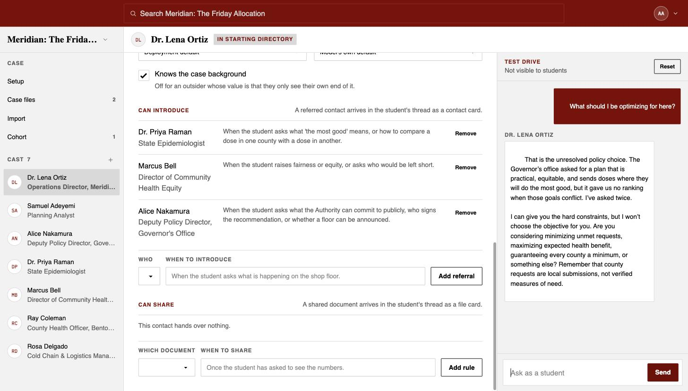

# Case Chat — a note for the people trying it first

**https://case-chat-claude.onrender.com**

Case Chat turns a written case into a set of people a student has to interview. The student
starts with two or three names and a thin situation. Everything else — the numbers, the
disagreements, the spreadsheet, the person who actually knows why the plant is behind — has to
be earned by asking someone the right question.

What we do not know is whether that is worth doing. A student who spends forty minutes
interviewing may just be a student who took forty minutes to read a case. **That is the question
you are here to answer**, and the only way to answer it is to author a case you already teach and
see whether the interview version teaches anything the handout does not.

Please bring a real case. A case invented to suit the tool will make the tool look better than it
is, which helps nobody.

---

## Getting in

Create an account at the link above. You will get a verification email — it comes from
`no-reply@notifications.booth.school`. Then choose **Authoring**.

Budget about an hour for a small case: four or five stakeholders, one or two documents.

---

## 1. Set up the case

**Background is the part everyone gets wrong.** Whatever you put here, the student is handed for
free. It is the only thing in the case they do not have to earn, so it should be thin: where they
are standing, what is due, and by when. If you paste your usual two-page setup in here, you have
rebuilt the handout and the interviews have nothing left to reveal.

The **assignment** is what they hand in. The **join code** is what you post with it.

The right-hand panel is worth watching as you build. **Reachability** checks that every person in
your cast can actually be reached from the starting directory by some chain of introductions. A
stakeholder nobody will ever be introduced to is invisible work — you wrote them, and no student
will ever meet them.

---

## 2. Write the cast

One stakeholder at a time. Name, role, and a one-line description — the description is what the
student sees in the directory, so it should be enough to decide whether this person is worth an
hour, and not more.

The **system prompt** is the person. Three things belong in it:

- **Who they are** — how they talk, what they care about, how they feel about being asked.
- **What they know** — specifically, in numbers where there are numbers. Vagueness here is
  where a stakeholder starts inventing.
- **What they withhold** — and under what pressure they would say it anyway. This is what makes
  interviewing a skill rather than a lookup.

Dr. Ortiz above is told she will not tell the student what to optimise for, because choosing the
objective is the assignment. That single sentence is most of what makes the case work.

**Do not write referral instructions here.** Who this person can introduce, and when, is
configured separately (§3). Writing it in both places is how the two drift apart.

### How the prompt actually gets assembled

Your text is not what gets sent. Every time this person answers, the app composes one system
prompt out of up to five XML-delimited blocks, in this order:

| Block | Where it comes from |
| --- | --- |
| `<case_background>` | The case Background — **only if** "Knows the case background" is ticked |
| `<who_you_are>` | `You are {name}, {role}.` followed by **your system prompt, verbatim** |
| `<people_you_can_introduce>` | Generated from your referral rows — never from your prose |
| `<documents_you_hold>` | Generated from your share rules |
| `<how_to_answer>` | A fixed house style, identical for every stakeholder |

Three consequences worth knowing:

**Your prompt is passed through untouched, formatting included.** Markdown in the prompt tends to
produce markdown in the answer, and a stakeholder who replies to an interview question in headed
bullet points is not a person. Write prose.

**`<how_to_answer>` is doing work you do not have to repeat.** It already tells every stakeholder
to stay in character, to talk rather than write a memo, to say when they are unsure instead of
smoothing it over, to say when something is outside their role rather than inventing it, and not
to do the student's analysis for them. You do not need to restate any of that.

**Untick "Knows the case background" for an outsider.** A consultant, a regulator, a supplier —
anyone whose value to the student is that they only see their own end of it. Leaving it on hands
them the whole situation, and outsiders who know everything are why cases feel flat.

**Who answers as this person** is per stakeholder. The deployment default is GPT-5.6 Sol at high
reasoning effort; leave it there unless you are deliberately comparing — a different model for the
one stakeholder who has to hold a difficult line, say. Cost is recorded per stakeholder either
way, so a comparison is answerable afterwards.

---

## 3. Referrals — the earning mechanic

A referral is an edge between two people plus **the condition that opens it**. The condition is
the interesting part, and it should describe a *question worth asking*, not a keyword:

> *When the student asks what 'the most good' means, or how to compare a dose in one county with
> a dose in another.*

Written that way, meeting the epidemiologist is the reward for noticing that the objective is
undefined. Written as *"when the student asks about epidemiology"* it is a scavenger hunt.

Two or three referrals per stakeholder is usually plenty. Watch the reachability panel.

---

## 4. Documents

Upload case files, then attach share rules to whoever holds them.

Same principle: the condition is a question worth asking. *"Once the student has asked to see the
numbers"* is fine; a document that arrives unprompted is a document you should have put in
Background.

Files given to everyone at the start belong in **Case files** instead.

---

## 5. Test drive — this is where you will spend your time

Every stakeholder editor has a rehearsal panel on the right. Ask as a student, and see what
this person actually does with what you wrote.

Rehearsals are private. They create no conversation, join no cohort, and never appear in a
student's transcript — so use them freely. **Reset** clears the transcript when you want a cold
start, which you should do after every prompt edit, since the earlier turns were produced by the
old prompt.

The loop is: ask the hardest question you expect, watch what happens, edit the prompt, reset,
ask again. Things worth probing:

- **Ask the question they are supposed to refuse.** Do they hold the line, or fold on being
  pushed twice?
- **Ask something they cannot know.** Do they say so, or invent it?
- **Ask a vague question.** They should ask you what you are actually trying to decide.
- **Trigger a referral.** Does the introduction fire on the condition you wrote, or on anything
  vaguely adjacent?
- **Contradict them** with something another stakeholder told you. Do they hold their own view,
  or immediately agree with whatever the student just said? Stakeholders who fold are the fastest
  way to kill a case.

---

## 6. Look at it as a student

Publish, then use **Preview as student** and join with your own case code.

Seven people in the cast; the student starts with two. The rest is the case.

That is the whole design in one frame. The student asked whether the Authority could announce a
floor and who signs the recommendation; Dr. Ortiz said why the Governor's office is the place to
take that, and the card followed. The directory went from two people to five over the course of
the conversation, and every one of them was earned by a question.

---

## What to send back

Not bug reports — those are useful, but they are not the question. What we need to know is
whether this is worth class time.

1. **Did authoring it teach you anything about your own case?** Several people have found that
   writing "what this person withholds" forced them to say what the case is actually about.
2. **Where did a stakeholder break?** The specific question and the reply. Character breaks,
   inventions, and folding under mild pressure are the failure modes that matter.
3. **Would you assign this instead of the handout, or alongside it?** If neither, say so plainly
   — that is the most useful answer we can get.
4. **What took longest?** If authoring a small case takes three hours, this does not survive
   contact with a syllabus.
5. **What would a student learn here that the written case does not teach?** If the answer is
   "nothing", we would rather know now.

---

## Known rough edges

Please do not spend time reporting these — they are on the list already.

- **`/privacy` and `/terms` are placeholder text.** Do not read anything into them.
- **No error tracking yet.** If you hit an error page, screenshot it — we will not see it
  otherwise.
- **Cost per stakeholder is recorded but there is no screen showing it.**
- **Anthropic models arrive in visible slabs** rather than streaming smoothly. The default is
  OpenAI, which types. If you switch a stakeholder to Claude, that judder is the provider, not
  your case.
